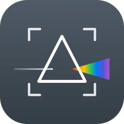

# Glimpse

サムネイル一覧で画像を眺めながら、選んだ画像（複数可）をそのままリサイズ・形式変換・切り抜き・連結できる Windows 用の画像ビューアです。

[image-sizechange](https://github.com/HatoAttack/image-sizechange) の後継として開発しています。

## 特長

- **軽い**: 見えている分のサムネイルだけを作り、エクスプローラーのサムネイルキャッシュも使います。1500 枚のフォルダを端までスクロールしてもメモリは約 150MB
- **いろいろな形式を読める**: JPG / PNG / GIF / WEBP など定番の形式に加え、Windows の拡張機能があれば HEIC / AVIF / JPEG XL / 各社 RAW も
- **一覧からそのまま編集**: 選んだ画像にリサイズ・形式変換・切り抜き・連結・名前の一括変更。元の画像を壊さない保存と、実行前の確認つき
- **ファイラとしても使える**: アドレスバー・フォルダツリー・フォルダ名の一部で飛べるフォルダジャンプ（[Everything](https://www.voidtools.com/) と連携も可）、コピー / 移動 / 削除、ドラッグ＆ドロップ
- **キーボードで完結**: ほとんどの操作にショートカットがあり、アドレスバーに「>」でコマンドを検索して実行できます
- **ライト / ダーク**: システムの配色に合わせるか、ライト / ダークを選べます

## 動作環境

- Windows 10 / 11（64 ビット）
- インストールは不要です（.NET も同梱しているので別に入れる必要はありません）
- HEIC / AVIF / RAW などを見るには、Microsoft Store の拡張機能が必要です（HEIC は「HEIF 画像拡張機能」＋「HEVC ビデオ拡張機能」、AVIF は「AV1 Video Extension」、RAW は「Raw Image Extension」）

## インストール・始め方

1. [Releases](https://github.com/HatoAttack/glimpse/releases/latest) から `Glimpse.exe` をダウンロードします
2. 好きな場所に置いて起動します
3. 初めはピクチャフォルダが開きます。フォルダは Ctrl+O・フォルダのドロップ・アドレスバーで開けます

新しいバージョンが出ると、起動時にフッターと ☰ メニューのヘルプでお知らせします。クリックすると変更内容を確認して、そのまま更新できます。

設定は `%LOCALAPPDATA%\ima-ge-viewer\` に保存されます。アンインストールするときは exe とこのフォルダを削除してください。

## 使い方

| やりたいこと | 操作 |
|---|---|
| 大きく表示する | Space（押し続けると離したときに閉じる）・ダブルクリック |
| 100% で見る（ピント・ノイズの確認） | 大きく表示中に Z を押している間（Space を押し続けて見ているときは使えない） |
| 選ぶ | クリック / Ctrl・Shift＋クリック / ドラッグで範囲選択 |
| チェックを付ける | ¥（付けて次へは ^）。チェックした画像を選ぶのは Ctrl+¥ |
| リサイズ・形式変換 | Ctrl+R（前回の設定のまま実行は Ctrl+Shift+R） |
| 切り抜き | Ctrl+K |
| 連結（2 枚以上） | Ctrl+M |
| 名前の変更 | F2 |
| フォルダーへ移動 / コピー | Ctrl+Shift+M / Ctrl+Shift+D |
| ごみ箱へ削除 | Del |
| フォルダジャンプ | Ctrl+J でフォルダ名の一部を入力（例: `2024 旅行`） |
| コマンドを探す | Ctrl+L で「>」に続けて入力 |
| 詳細情報 | Ctrl+I（撮影日時・カメラ・レンズなど） |
| サムネイルの大きさ | Ctrl+ホイール・フッターのスライダー |
| メニュー | ☰（Alt / F10） |

画像を選ぶと、フッターが編集の操作ボタンに変わります。右クリックメニューからも同じ操作ができます。

機能と設定項目の詳しい説明は [docs/features.md](docs/features.md) にあります。

## 今後の予定

- [ ] 1 枚表示での GIF / WEBP アニメの再生

UI の設計は [docs/ui-concept.md](docs/ui-concept.md) にまとめています。

## 開発に貢献する方法

不具合の報告・要望・プルリクエストを歓迎します。

- **不具合の報告・要望**: [Issues](https://github.com/HatoAttack/glimpse/issues) に書いてください。不具合は、再現する手順・画像の形式・Windows のバージョンがあると助かります
- **プルリクエスト**: 大きな変更は先に Issue で相談してもらえると行き違いがありません

開発に必要なもの: Windows・[.NET 8 SDK](https://dotnet.microsoft.com/download/dotnet/8.0)

```
git clone https://github.com/HatoAttack/glimpse.git
cd glimpse
dotnet run --project src/ImageViewer.App
dotnet run --project tests/ImageViewer.Tests
```

プロジェクトの構成・コマンドの追加方法・保存データ・リリースの手順は [docs/development.md](docs/development.md) を見てください。

## ライセンス

[MIT License](LICENSE)

画像の読み書きに使っている [ImageSharp](https://github.com/SixLabors/ImageSharp) は [Six Labors Split License](https://github.com/SixLabors/ImageSharp/blob/main/LICENSE) です。
